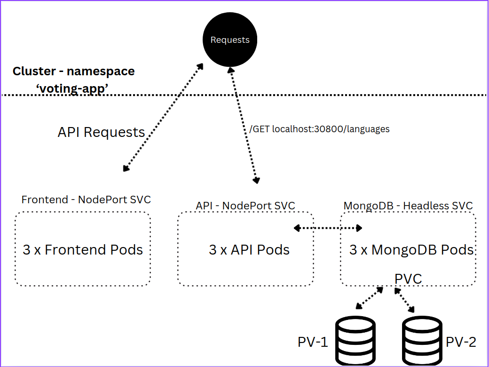
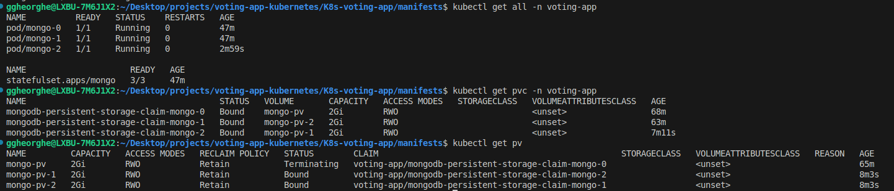
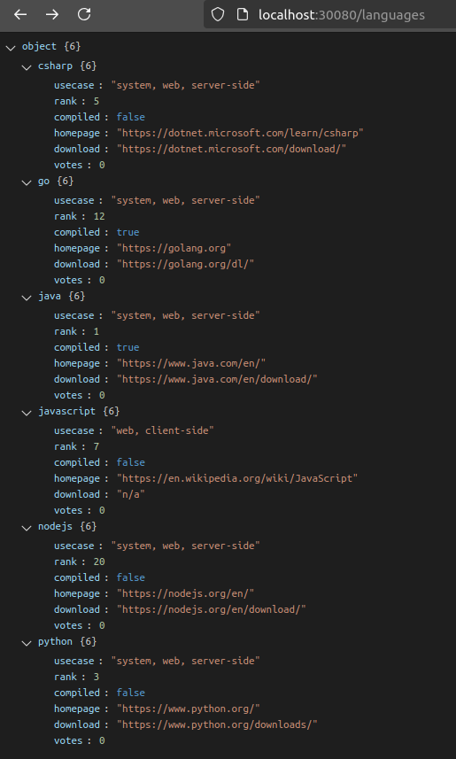
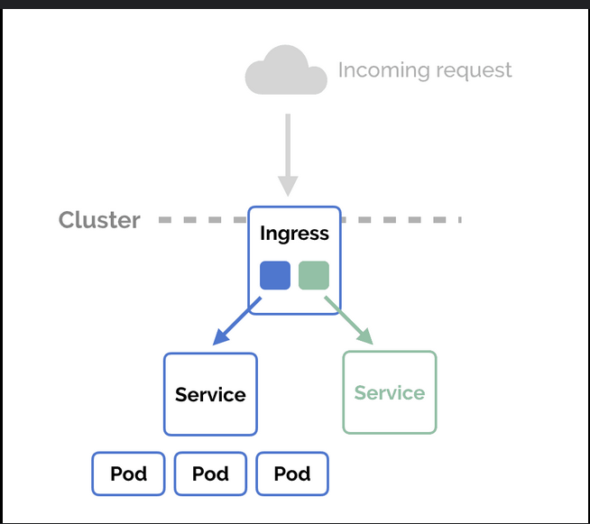
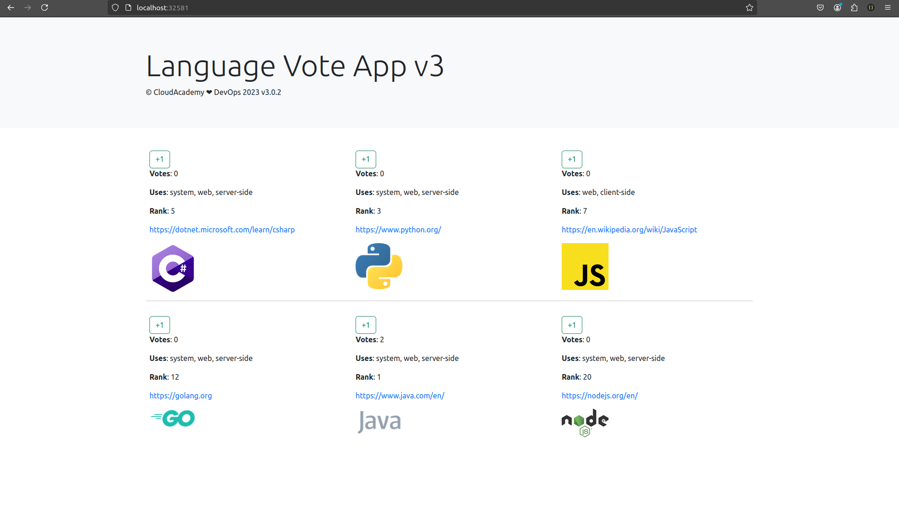

# Deploying a Voting App in a Kubernetes Microservices Cluster with Rancher

This project deploys a **Voting App** in a **Kubernetes cluster** with **Rancher** for local support and management. The app uses **MongoDB** for the database and **Node.js** for the backend. Each component is containerized, and Kubernetes orchestrates the services. An **Ingress object** is set up to manage external access, directing traffic to the appropriate services and disable the CORS policy . Rancher simplifies monitoring, scaling, and managing the microservices locally.



# Cluster Structure

In the **'voting-app'** namespace, three microservices were deployed, each using its own **Deployment** object:

-   **Frontend Deployment**: Exposed locally to users via a **NodePort Service**.
-   **API Deployment**: Also exposed through a **NodePort Service**, allowing it to be accessed by other projects via the following endpoints:
    -   `http://localhost:30080/languages`
    -   `http://localhost:30080/languages/<specific-programming-language>`
-   **MongoDB**: Deployed as a **StatefulSet** and exposed using a **Headless Service** to ensure stable network identities for the pods, being typical used for stateful applications.

### 1. Deploy MongoDB Pods in Cluster

To deploy MongoDB instances in the **'voting-app'** namespace within your Kubernetes cluster, follow these steps:
- **Persistent Volume (PV) Setup**:
	-   Create and deploy Persistent Volumes (PVs). Since the deployment is local, you'll create the PVs manually. If this were in the cloud, you'd instead configure your cluster to use cloud-based storage options (like AWS EBS or Azure Disk). 
- **StatefulSet Creation**:
	-   Deploy MongoDB as a **StatefulSet**, which ensures persistent storage and stable network identities for MongoDB pods.
	-   The **PersistentVolumeClaim (PVC)** is declared in the StatefulSet manifest and will automatically bind to the created PVs:
``` yaml 
volumeClaimTemplates:
	- metadata:
		name: mongodb-persistent-storage-claim
		spec:
			accessModes:
				- ReadWriteOnce
			resources:
			requests:
				storage: 0.5Gi
			storageClassName: ""
```
**! Note**: If you're running the cluster locally (on-premises or using tools like Minikube or Rancher Desktop), you'll need to manually define and manage **Persistent Volumes (PVs)** when using **PersistentVolumeClaims (PVCs)** - *check 'mongo-pv.yaml' for PVs declaration*

 - **Replica Set Configuration**:
	-   Set **mongo-0** as the **primary node** and **mongo-1** and **mongo-2** as **secondary nodes**. Replica set configuration ensure high availability and data redundancy.
		1. Access the MongoDB shell by running: ` kubectl exec -it mongo-0 -n voting-app -- mongo`
		2. Then, execute the following script:
```
cat << EOF | kubectl exec -it mongo-0 -- mongo
rs.initiate();
sleep(2000);
rs.add("mongo-1.mongo:27017");
sleep(2000);
rs.add("mongo-2.mongo:27017");
sleep(2000);
cfg = rs.conf();
cfg.members[0].host = "mongo-0.mongo:27017";
rs.reconfig(cfg, {force: true});
sleep(5000);
EOF
```
And to verify the configuration run the command: ` kubectl exec -it mongo-0 -n voting-app -- mongo --eval "rs.status()" | grep "PRIMARY\|SECONDARY"
 `
 - **Adding Data to MongoDB**: you can create a new database runnig the following command:
 
 ```bash
 use langdb()
db.languages.insert({
    "name" : "csharp", 
    "codedetail" : { 
        "usecase" : "system, web, server-side", 
        "rank" : 5, 
        "compiled" : false, 
        "homepage" : "https://dotnet.microsoft.com/learn/csharp", 
        "download" : "https://dotnet.microsoft.com/download/", 
        "votes" : 0
    }
});
```



### 2. Deploy API Pods in Cluster
- Before deploying the API pods, deploy our **Secret Config** credentials to securely store the credentials needed by API pods to access the MongoDB database. The configurations are used in *env* manifest field:
``` yaml
containers:
	- name: api
		image: cloudacademydevops/api:v3
		imagePullPolicy: Always
		env:
			- name: MONGO_CONN_STR
				value: mongodb://mongo-0.mongo,mongo-1.mongo,mongo-2.mongo:27017/langdb?replicaSet=rs0
			- name: MONGO_USERNAME
				valueFrom:
					secretKeyRef:
						name: mongodb-secret
						key: username
			- name: MONGO_PASSWORD
				valueFrom:
					secretKeyRef:
						name: mongodb-secret
						key: password
```

- To deploy API microservice, you have to run the command: 
`kubectl apply -f api-manifest.yaml` , where is also described a **NodePort Service** which expose the Pod locally and make the API public in local area network.



### **Why NodePort and not a LoadBalancer?**
-   In local Kubernetes environments (like Rancher, Minikube, or Docker Desktop), the **LoadBalancer** service type typically doesn’t work as it does in cloud environments. Using **NodePort** allows you to expose your service on a specific port of your node.

### 3. Deploy Frontend Pods in Cluster

To deploy the frontend, apply the frontend deployment configuration with the following command:
```bash
kubectl apply -f frontend-deployment.yaml
```

### 4. Deploy NGINX Ingress Controller

This Ingress configuration allows external HTTP requests to reach the `api` service within the `voting-app` namespace by routing traffic sent to `localhost`. It specifies CORS settings to permit requests from `http://localhost:32581` *(Frontend Microservice)* , allowing specific HTTP methods (`GET`, `POST`, `OPTIONS`) and headers (`Content-Type`, `Authorization`). 

Also, this setup ensures that any request to the root path (`/`) will be forwarded to the `api` service on port `30080`, facilitating communication between the frontend and the backend API while managing CORS issues effectively. 



#### Install setup:
- Apply the manifest directly:

		kubectl apply -f https://raw.githubusercontent.com/kubernetes/ingress-nginx/main/deploy/static/provider/cloud/deploy.yaml

- Create an Ingress Resource:
```yaml
apiVersion: networking.k8s.io/v1
kind: Ingress
metadata:
  name: api-ingress
  namespace: voting-app
  annotations:
    nginx.ingress.kubernetes.io/cors-allow-origin: "http://localhost:32581"  # your frontend URL
    nginx.ingress.kubernetes.io/cors-allow-methods: "GET, POST, OPTIONS"
    nginx.ingress.kubernetes.io/cors-allow-headers: "Content-Type, Authorization"
spec:
  rules:
    - host: your-api.example.com  # your domain
      http:
        paths:
          - path: /
            pathType: Prefix
            backend:
              service:
                name: your-backend-service  # backend specific path service name
                port:
                  number: 30080  # specific backend service port

```

- Apply the configuration:

		kubectl apply -f ingress.yaml

## Final Web Page:




